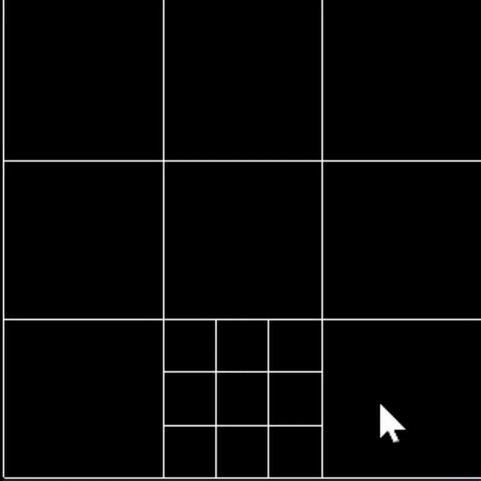

# Square Paint

Paint a picture using dividable squares

## Use

Run by way of the executable: `.\x64\Release\SquarePaint.exe`

Controls are as follows:

<ul>
<li>Left click to colour in a square</li>
<li>Right-click to divide the square into 9 sub squares</li>
<li>Scroll to zoom the frame</li>
<li>Arrow keys to pan the frame</li>
<li>click 'P' to bring up the palette for colouring squares</li>
<li>click 'O' to hide/unhide the grid</li>
<li>click 'I' to bring up the palette for colouring the grid</li>
</ul>

### nota bene

This project utilises `GLUT` and paints the squares recursively, therefore it is build to work on `x64` Windows.